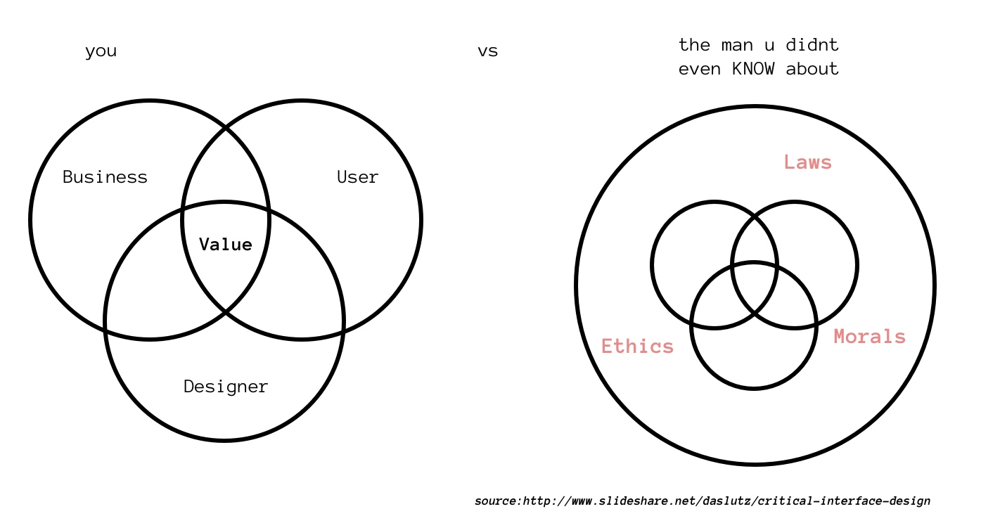

# critical interface design
In my observations of design culture, critical discussions of ethics, morals, and culture flourish in architecture, fashion, and graphic design. However, I have yet to see similar discourse for interface design. This learning group seeks change that.

## what is critical interface design?

>  "When we look for specific literature on interface design, we mainly find two types of books: declarations of intent in the form of good design principles, and books that describe patterns based on previous experiences. The weakness of both types is that they encourage an innocent approach to interface design. At a time when interfaces are a very important part of our culture, there is a need for much more mature reflection on how we want them to be designed." - Rosa Llop

## questions/trends i've been pondering
1. How do we build things that can potentially last forever?
2. Is there more to product design that satisfying instant gratification culture?
3. How might we incorporate psychological health into product design?
4. Are there pitfalls to clean & simple? What are they?
5. What are the foundations that should be included in the product design practice?
6. What can history tell us about the future of product design?
7. Balance of business and ethics
8. The dopamine releases of using the internet media (addiction)

## readings
* https://interfacemanifesto.hangar.org/index.php/One_Size_Fits_None._Towards_Critical_Interface_Design_By_Rosa_Llop
- http://www.slideshare.net/daslutz/critical-interface-design
- https://resilientwebdesign.com/

## how does this work?
I'm thinking of setting up discussion groups that work in this order:
 1. Discussion on concerns of current interface design
 2. Discussion on how to address those concerns in future interface design

## extra
If you would like to create a discussion, use branching...[details tbd]
